## PROJECT 4 MEAN

### Step 1: Install NodeJS

`sudo apt install -y nodejs`

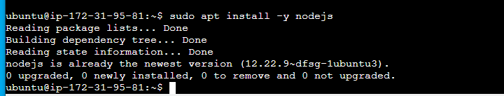

### Step 2: Install MongoDB

`sudo apt-key adv --keyserver`

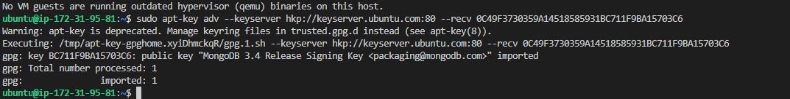

`echo "deb`

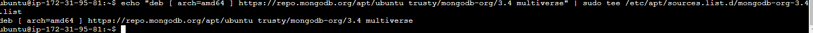

`sudo apt install -y mongodb`

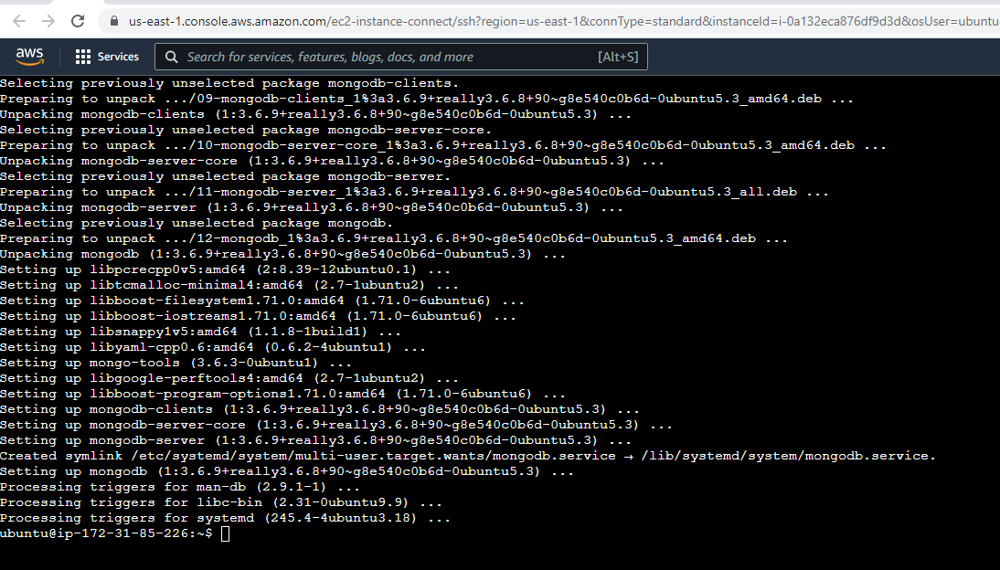

### start mongodb Server

`sudo service mongodb start`

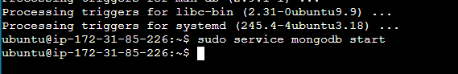

`Verify that the service is up and running`

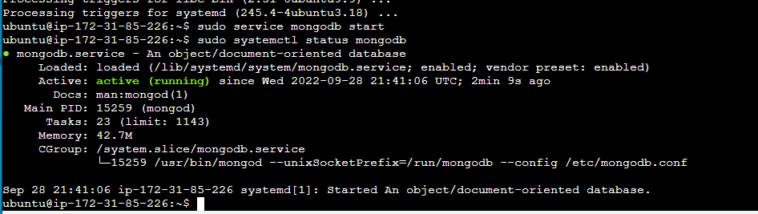

### Install npm – Node package manager.

`sudo apt install -y npm not run because it is part of nodeJS 18.x installation`

### Install body-parser package

`sudo npm install body-parser`

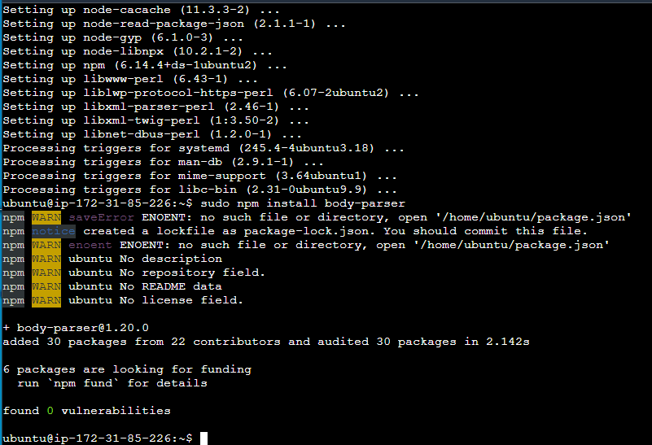

`mkdir Books && cd Books`

`npm init `

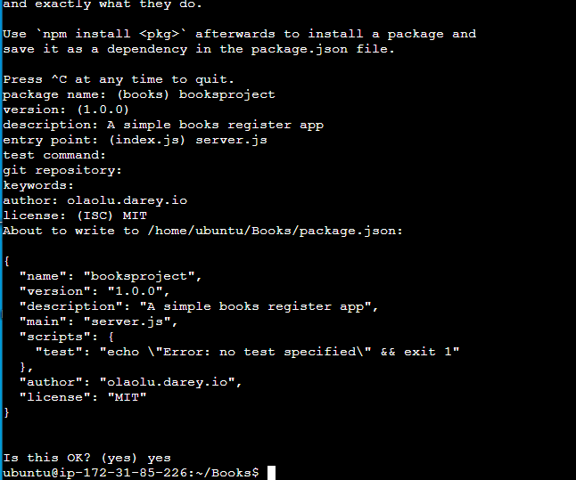

`vi server.js`

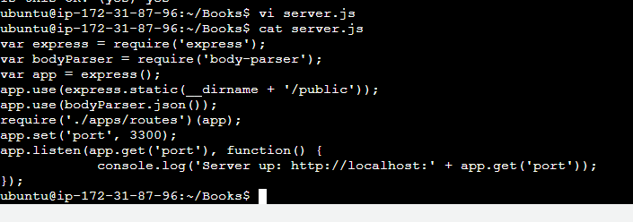

### Step 3: Install Express and set up routes to the server

`sudo npm install express mongoose`

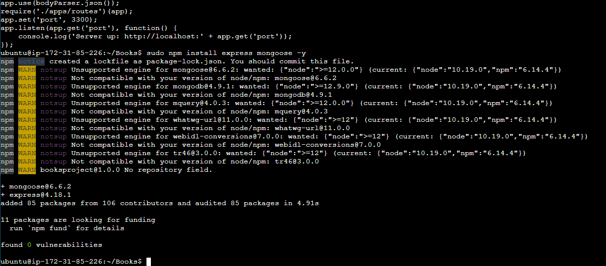

`mkdir apps && cd apps`

`vi routes.js`

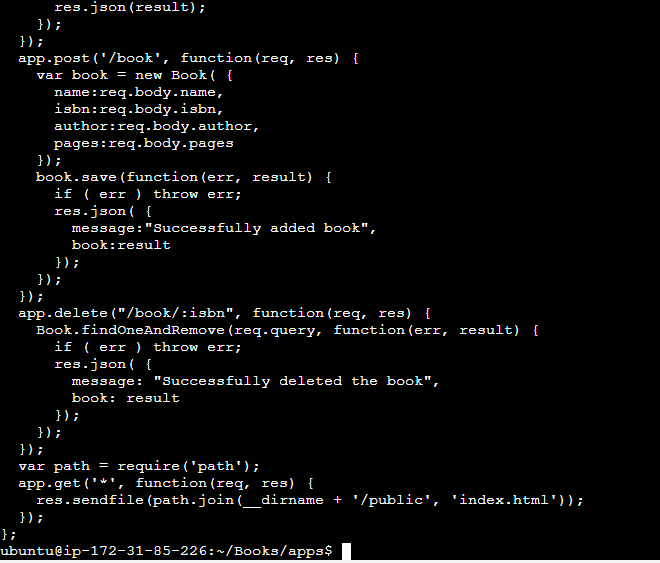

`mkdir models && cd models`

`vi book.js`

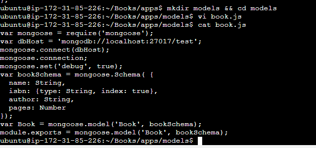

### Step 4 – Access the routes with AngularJS

`mkdir public && cd public`

`vi script.js`

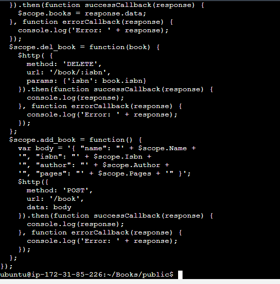

`vi index.html`

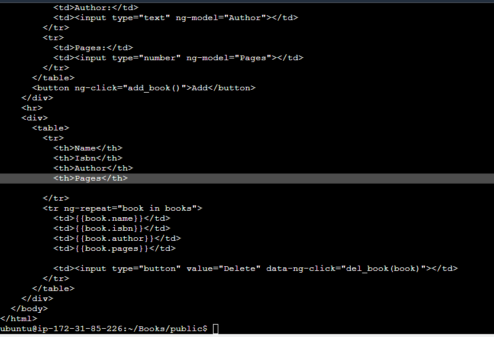

### Start the server by running this command:

`node server.js`

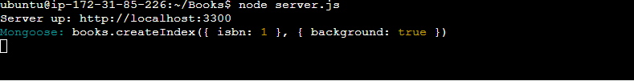

`curl -s http://localhost:3300`

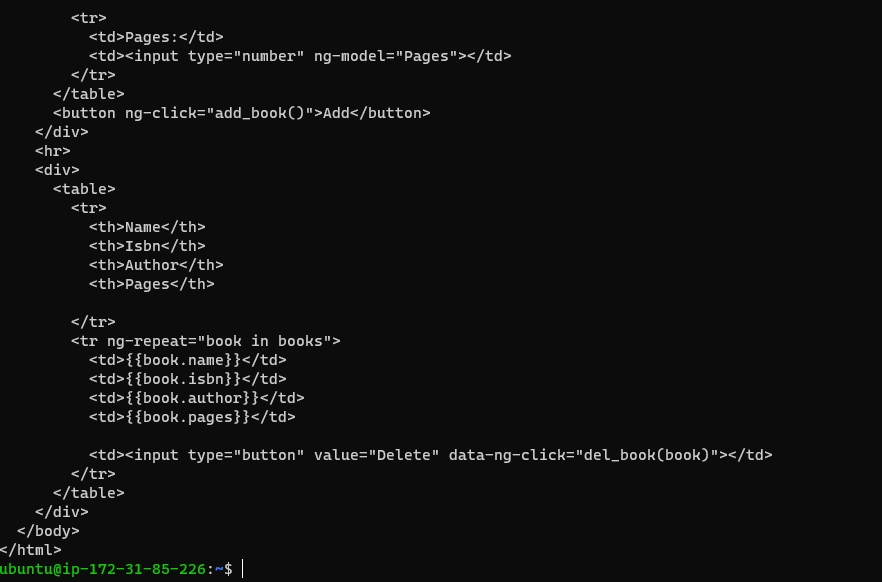

### open TCP port 3300 in your AWS Web Console for your EC2 Instance

`launch address on Web browser`

 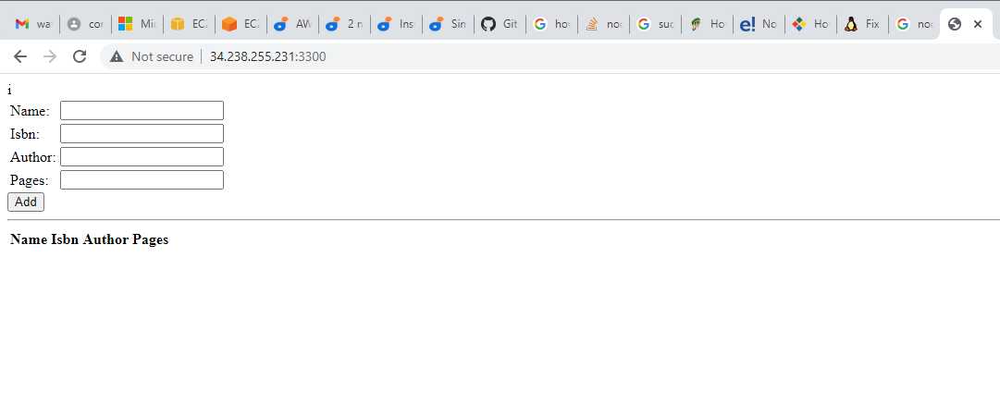

 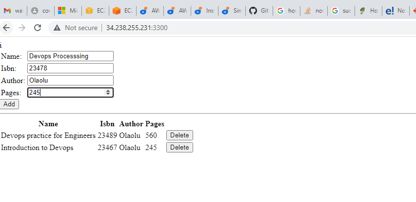

 ### The End of Project Four

 ## THANK YOU